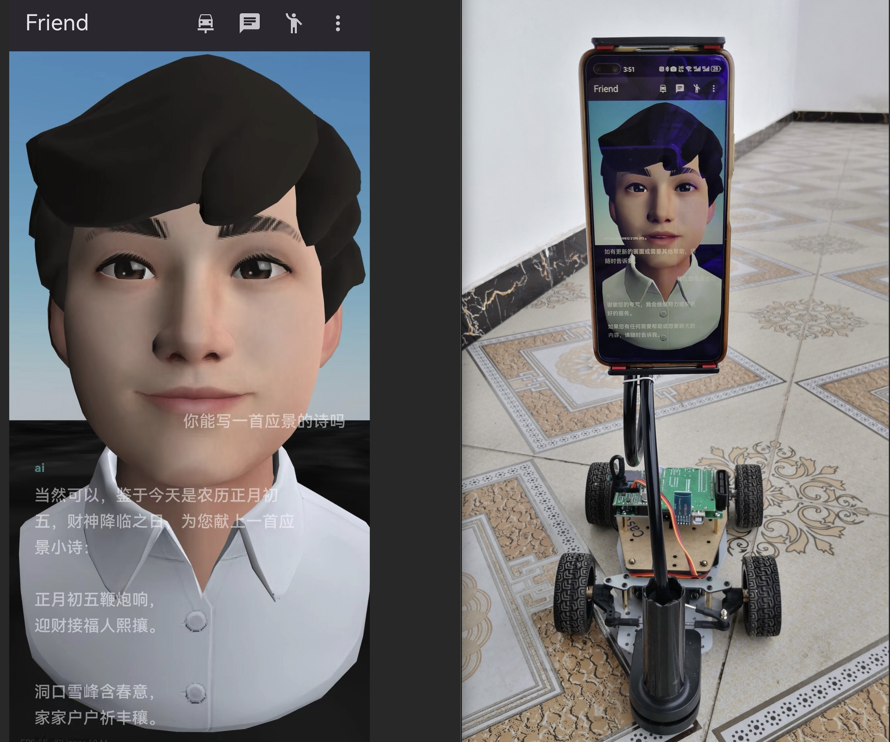

# Demo 


文档整理中，敬请期待

# INSTALL

```
python -m pip install -r requirements.txt
```

# 运行
## rtc server

* livekit-server 依赖于 redis，请确保 redis 已启动。
```
livekit-server --config config.yaml
```

* RTC API 
	* 提供RTC的token、文件存储等功能
```
python3 app.py
```

## Agent 服务
* 音视频处理服务
	* 识别语音
	* 通过视觉模型解析场景
```
python agents/agent.py start
```

* LLM
	* 接受Agent信息，通过LLM 接口与用户交互
```
python agents/msg_consume.py
```
